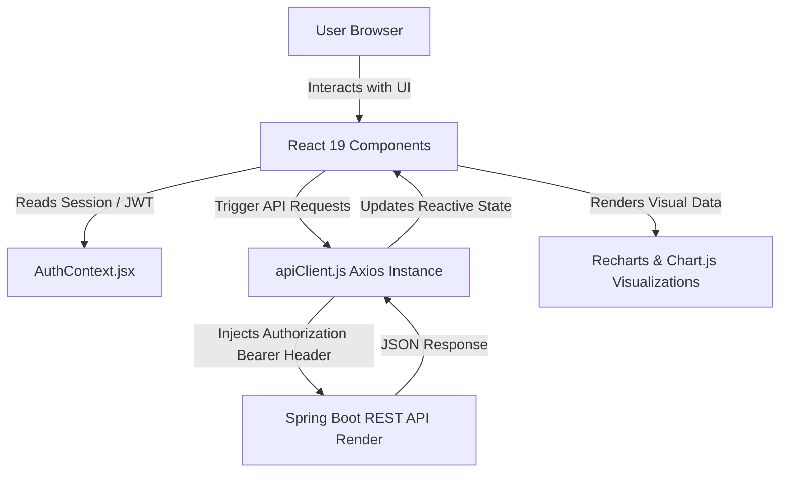

# ExpenseTracker 💰 (Frontend)


ExpenseTracker is a responsive, modern single-page application (SPA) built with **React 19**, **Vite**, **Tailwind CSS v4**, and **Axios**. It features reactive state management, interactive data visualization charts (**Recharts** & **Chart.js**), dark/light mode toggle, dynamic budget tracking, and real-time JWT authentication handling.

🌐 **Live Web Application (Vercel):** 👉 [expense-tracker-frontend-iota-one.vercel.app](https://expense-tracker-frontend-iota-one.vercel.app)  
🌐 **Live Mirror (Netlify):** [expense-tracker-ankush.netlify.app](https://expense-tracker-ankush.netlify.app)  
⚙️ **Backend API (Render):** `https://expense-tracker-backend-1-885b.onrender.com`

---

## 🏗️ System Architecture & Data Flow



---

## 🔐 Key Architecture Highlights

- **Global Authentication Context (`AuthContext.jsx`)**: Centralized reactive session management tracking `token`, `userId`, `userName`, and authentication status across all client routes.
- **Centralized Axios Client (`apiClient.js`)**:
  - Request interceptor automatically attaches `Bearer <token>` from `localStorage` to all outgoing requests.
  - Response interceptor handles global errors (including `401 Unauthorized` token expiry handling).
- **Protected Client Routes**: Guards shield private pages (`/dashboard`, `/add-expense`) from unauthenticated access, automatically redirecting guests to Login.
- **Visual Analytics**: Interactive Category Pie Charts, Monthly Spending Line Graphs, and Top Category Bar Charts powered by **Recharts** and **Chart.js**.

> [!NOTE]
> Environment fallback: `apiClient.js` automatically targets `VITE_API_URL` when provided, defaulting to `http://localhost:8080` for local development.

---

## 🔹 Features

- ✅ **JWT Authentication**: Registration and Login with client-side validation and toast notifications.
- ✅ **Reactive Context State**: Immediate UI updates upon login/logout without page reloads.
- ✅ **Dashboard Analytics**: Category breakdown pie charts, monthly trend graphs, and budget indicator cards.
- ✅ **Budget Management**: Set spending targets and view automated budget carry-forward warnings.
- ✅ **Expense Operations**: Add, filter, update (modal), and delete expenses with SweetAlert2 prompts.
- ✅ **Theme Customization**: Seamless dark and light theme toggle with persistent state.
- ✅ **Fully Responsive**: Tailored layout across mobile, tablet, and desktop screens.

---

## 🔹 Technologies Used

- **Core**: React 19, React DOM 19, JavaScript (ES6+), HTML5, CSS3
- **Build Tool**: Vite 6
- **Styling**: Tailwind CSS v4, Lucide React Icons
- **HTTP Client**: Axios (with custom request/response interceptors)
- **Charts & Data Visualization**: Recharts 3, Chart.js 4, `react-chartjs-2`
- **UI Notifications & Modals**: React Toastify, React Hot Toast, SweetAlert2
- **Routing**: React Router DOM 7
- **Deployment**: Netlify & Vercel

---

## 🔹 Project Structure

```
expense-tracker/
├── public/
│   └── _redirects
├── src/
│   │   App.jsx
│   │   index.css
│   │   main.jsx
│   │
│   ├── assets/
│   │   └── images/
│   │           login.png
│   │           spending.png
│   │
│   ├── components/
│   │   │   ExpenseForm.jsx
│   │   │   FloatingInput.jsx
│   │   │   Navbar.jsx
│   │   │
│   │   ├── charts/
│   │   │       BudgetUsageChart.jsx
│   │   │       CategoryPieChart.jsx
│   │   │       MonthlyLineChart.jsx
│   │   │       TopCategoryBarChart.jsx
│   │   │
│   │   └── dashboard/
│   │           EditExpenseModal.jsx
│   │           ExpenseFilters.jsx
│   │           ExpenseTable.jsx
│   │           SummaryCards.jsx
│   │
│   ├── context/
│   │       AuthContext.jsx
│   │
│   ├── pages/
│   │       AddExpense.jsx
│   │       Dashboard.jsx
│   │       Login.jsx
│   │       Register.jsx
│   │
│   ├── services/
│   │       apiClient.js
│   │       BudgetService.js
│   │       ExpenseService.js
│   │
│   └── utils/
│           categoryColors.js
│           swalTheme.js
│
├── .env
├── package.json
└── vite.config.js
```

---

## 🔹 Environment Variables Reference

| Variable | Description | Default / Local | Production Example |
|---|---|---|---|
| `VITE_API_URL` | Base URL of Spring Boot REST API | `http://localhost:8080` | `https://expense-tracker-backend-1-885b.onrender.com` |

---

## 🔹 How to Run Locally

### Prerequisites
- **Node.js** (v18+)
- **npm** (v9+)

### Installation Steps

1. **Clone the repository:**
   ```bash
   git clone https://github.com/ankushbadgujar002/expense-tracker-frontend.git
   cd expense-tracker-frontend
   ```

2. **Install dependencies:**
   ```bash
   npm install
   ```

3. **Configure Environment Variables:**
   Create a `.env` file in the root directory:
   ```env
   VITE_API_URL=http://localhost:8080
   ```
   *(To test against the live Render backend, set `VITE_API_URL=https://expense-tracker-backend-1-885b.onrender.com`)*

4. **Start Development Server:**
   ```bash
   npm run dev
   ```
   The application will be accessible at `http://localhost:5173`.

5. **Build for Production:**
   ```bash
   npm run build
   ```

---

## 🔹 Deployment Details

| Component | Provider | Live URL |
| :--- | :--- | :--- |
| ⚛️ **Frontend App** | **Vercel / Netlify** | [expense-tracker-frontend-iota-one.vercel.app](https://expense-tracker-frontend-iota-one.vercel.app) |
| 🍃 **Backend API** | **Render.com** | `https://expense-tracker-backend-1-885b.onrender.com` |
| 🗄️ **Database** | **Railway.app** | Managed Cloud MySQL 8.4 |

---

## 🔹 Author

**Ankush Badgujar**  
Information Technology Student  
Frontend Web Developer (Fresher) | Full Stack Java Developer (Fresher)

- **GitHub:** [@ankushbadgujar002](https://github.com/ankushbadgujar002)
